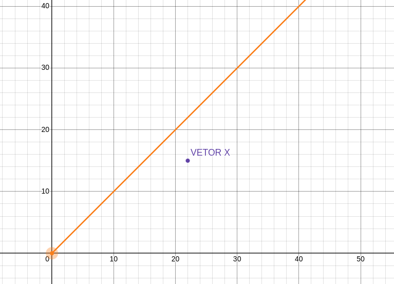

Regressão é um tipo de modelo que simplifica a classificação um dado de um dominio mais fechado. Ou seja, dentro de um conjunto de dados limitados que formam um dominio a regressão atua de forma otimizada para classificação do mesmo.

Isso se deve a caracteristica do treinamento, que é mais custosa e mais dificil de fazer fine tunning, enquanto sua classificação baseda no modelo treinado é muito otimizada simplificada.


É possível aferir o custo do treinamento observando sua formula:

```ts
w=(XTX)−1(XTy)

1. XT = Xᵀ
2. A  = XT · X
3. A⁻¹ = gauss_jordan(A) ← Gauss-Jordan aqui
4. b  = XT · y           ← y entra AQUI
5. w  = A⁻¹ · b
```

Quanto maior a matriz, maior é o custo de processamento.

Enquanto que a formula de classificação é muito mais simples:

s = w . x + b

Olha o exemplo abaixo para o treinamento de uma matriz com vetores de 2 dimensões:

```ts
[1, 0]
[10, 1]
[0, 5]
[2, 0]
```

podemos aplicar a forma com as etapas:

```ts
matriz_transposta = [1,10,0,2]
                    [0, 1,5,0]

y = [0,0,1,1]
```

Calculando a matriz transposta vezes a matriz original, temos uma matriz quadrada:

```ts
[105, 10]
[10,  26]
```

Reduzindo ela com gauss-jordan, neste caso, temos a matriz identidade:


```ts
[1,0]
[0,1]
```

Calculando w e o bias, graças a matriz identidade anterior

```ts
bias = [2, 5]
w    = [2, 5]
```

então temos nosso modelo:

```ts
{
    "bias_classe_A":2,
    "bias_classe_B":5,
    "w_classe_A":2,
    "w_classe_B":5
}
```

Ou seja, um modelo bem simplificado. 

Agora, com dado um vetor `x=[10, 2]` na formula `s = w . x + b`podemos testar cada hipotese de uma classe verificar o maior score para a classificação:


```ts 
classe_A = 10 * 2 + 2 = 22 
classe_B =  2 * 5 + 5 = 15
```

Como a classe A tem o maior score, ela vence.

É interessante ver o efeito disso no plano cartesiano:



A classe A é o eixo x do vetor final `[22,15]` e se olharmos para o plano cartesiano podemos reparar que o vetor tende ao eixo X, por isso ele é classificado como classe_A.
